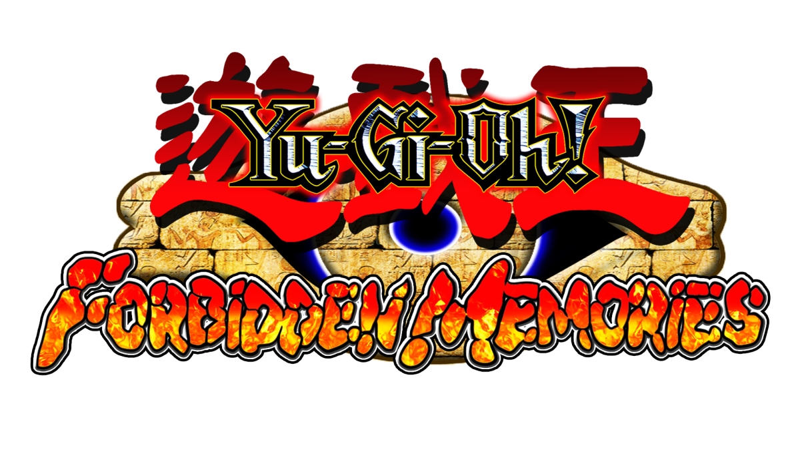
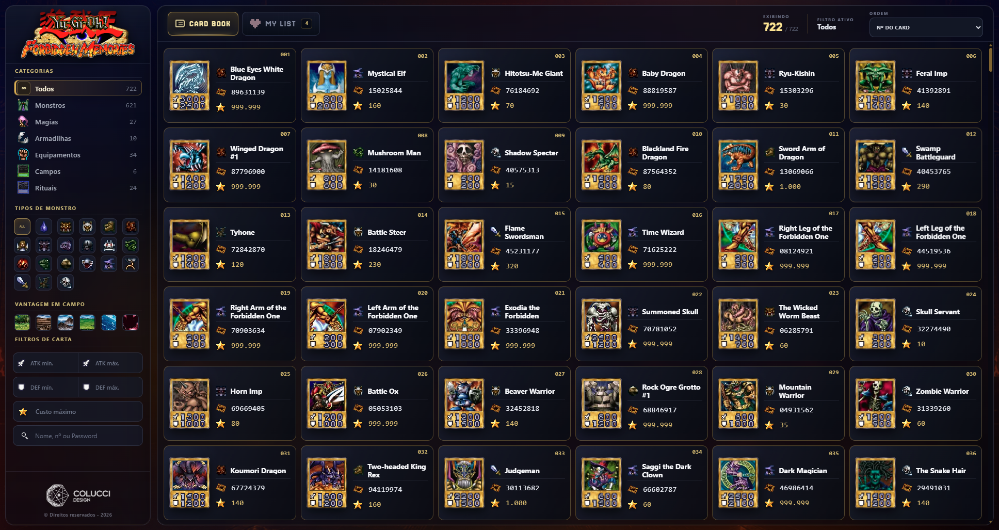
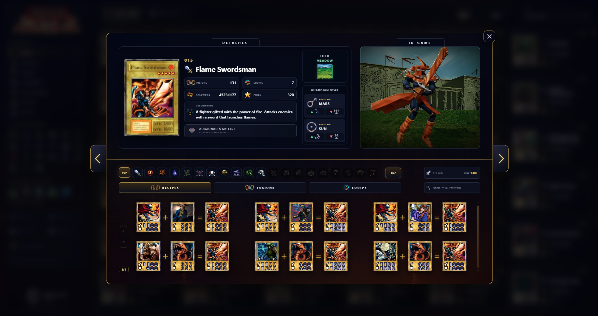

<p align="center">
  
  &nbsp;&nbsp;&nbsp;&nbsp;
  
</p>

<h1 align="center">Yu-Gi-Oh! FM · Card Vault</h1>

<p align="center">
  Uma experiência visual moderna para consultar as 722 cartas de <strong>Yu-Gi-Oh! Forbidden Memories</strong>, preservando a identidade, os sprites e a atmosfera do jogo original.
</p>

<p align="center">
  
  
  
  
  
</p>

## Visão geral

O Yu-Gi-Oh! FM Card Vault foi criado para localizar cartas rapidamente pela aparência, sem depender apenas do nome. Cada minicard exibe as informações essenciais de imediato, enquanto o painel de detalhes reúne dados de jogo, relações de fusão e navegação entre cartas em uma única interface responsiva.

## Preview

<table>
  <tr>
    <td width="50%">
      <a href="screenshots/card-book-navigation.mp4">
        
      </a>
    </td>
    <td width="50%">
      <a href="screenshots/card-details-navigation.mp4">
        
      </a>
    </td>
  </tr>
  <tr>
    <td align="center"><a href="screenshots/card-book-navigation.mp4">▶ Ver navegação pelo Card Book</a></td>
    <td align="center"><a href="screenshots/card-details-navigation.mp4">▶ Ver navegação pelos detalhes</a></td>
  </tr>
</table>

## Funcionalidades

- Card Book com 722 cartas e visual inspirado na interface de Forbidden Memories.
- Nome, número, tipo, Password, custo em Starchips e ATK/DEF visíveis diretamente nas minicards.
- Busca por nome, número ou Password.
- Filtros por categoria, tipo de monstro, vantagem de campo, custo e faixas mínimas/máximas de ATK e DEF.
- Ordenação por custo em Starchips e navegação paginada otimizada para desktop e mobile.
- My List com favoritos persistidos localmente no navegador.
- Overlay de detalhes com imagem da carta, descrição, Field e relações de Guardian Star.
- Prévias in-game em vídeo para monstros e mídia alternativa para cartas sem modelo 3D.
- Consulta de Recipes, Fusions e Equips com filtros por tipo, ATK máximo e pesquisa interna.
- Acesso direto às cartas relacionadas com confirmação visual e histórico de retorno.
- Navegação anterior/próxima dentro do overlay, sem recarregar a página.
- Efeitos visuais inspirados no jogo: sprites mapeados, pulse, glow e shine sweep.
- Layout responsivo com interações específicas para telas menores.

## Executar localmente

### Requisitos

- Node.js 22.13 ou superior.
- pnpm 11.9 ou superior, diretamente ou via Corepack.

### Windows

Dê duplo clique em [`START-YUGIOH-FM-CARD-VAULT.cmd`](START-YUGIOH-FM-CARD-VAULT.cmd). Na primeira execução, o iniciador instala as dependências quando necessário e abre o servidor em `http://localhost:3000/`.

### Terminal

```bash
pnpm install --frozen-lockfile
pnpm dev
```

## Validação

```bash
pnpm test
pnpm lint
pnpm details:audit -- --all --published
```

## Estrutura principal

```text
app/                     Interface, componentes e dados-base
public/cards/            Imagens das 722 cartas
public/data/             Payloads de detalhes publicados
public/game-assets/      Sprites, campos, vídeos e identidade visual
screenshots/             Imagens e demonstrações do projeto
scripts/                 Extração, normalização, auditoria e publicação de dados
tests/                   Validações automatizadas
worker/                  Entrada de execução para Cloudflare Workers
```

## Base de dados e desempenho

- 722 payloads de detalhes normalizados.
- 621 modelos 3D em WebM servidos localmente.
- Fallback visual para 101 cartas sem animação 3D.
- 25.146 Recipes, 50.242 Fusions e 8.100 relações de Equip.
- Carregamento sob demanda, cache em memória e prefetch das cartas adjacentes.

A metodologia de captura, normalização e auditoria está documentada em [`docs/CARD-DATA-PIPELINE.md`](docs/CARD-DATA-PIPELINE.md).

O histórico de marcos está em [`CHANGELOG.md`](CHANGELOG.md) e a convenção de versões em [`docs/VERSIONING.md`](docs/VERSIONING.md).

## Créditos e aviso legal

Dados e referências visuais foram conferidos a partir do [Fusion Simulator](https://fusion.lukadevv.com/), da [galeria do Yu-Gi-Oh! Wiki](https://yugioh.fandom.com/wiki/Gallery_of_Yu-Gi-Oh!_Forbidden_Memories_cards), do [guia de Passwords e Starchips no GameFAQs](https://gamefaqs.gamespot.com/ps/561010-yu-gi-oh-forbidden-memories/faqs/18828) e dos [ícones de tipo no Yugipedia](https://yugipedia.com/wiki/Category:Yu-Gi-Oh!_Forbidden_Memories_Type_icons).

Projeto de fã, não oficial e sem fins comerciais. Yu-Gi-Oh! e seus elementos pertencem aos respectivos detentores de direitos. O código e o design desta interface são um trabalho autoral de **Colucci Design & Comunicação Ltda**.
